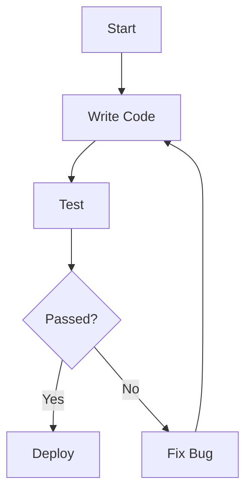
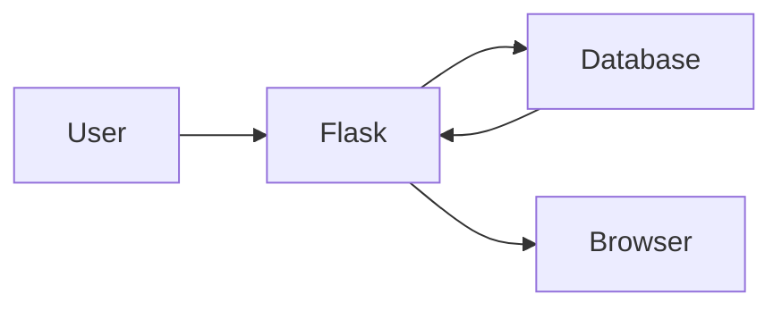
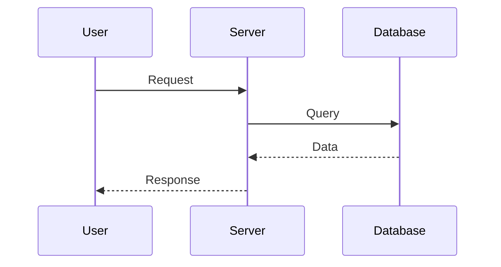
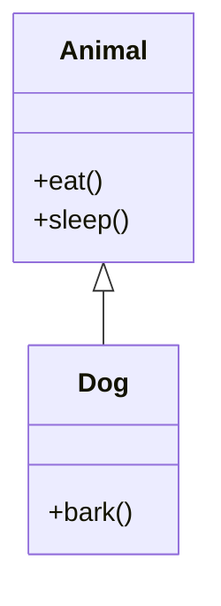
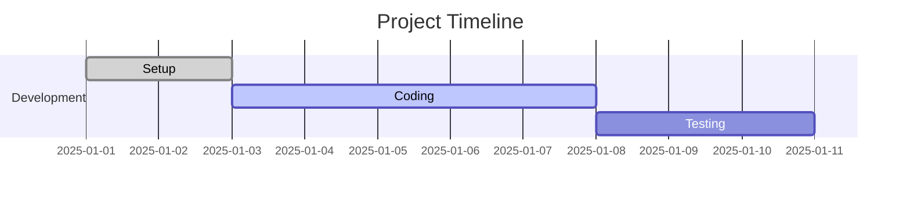
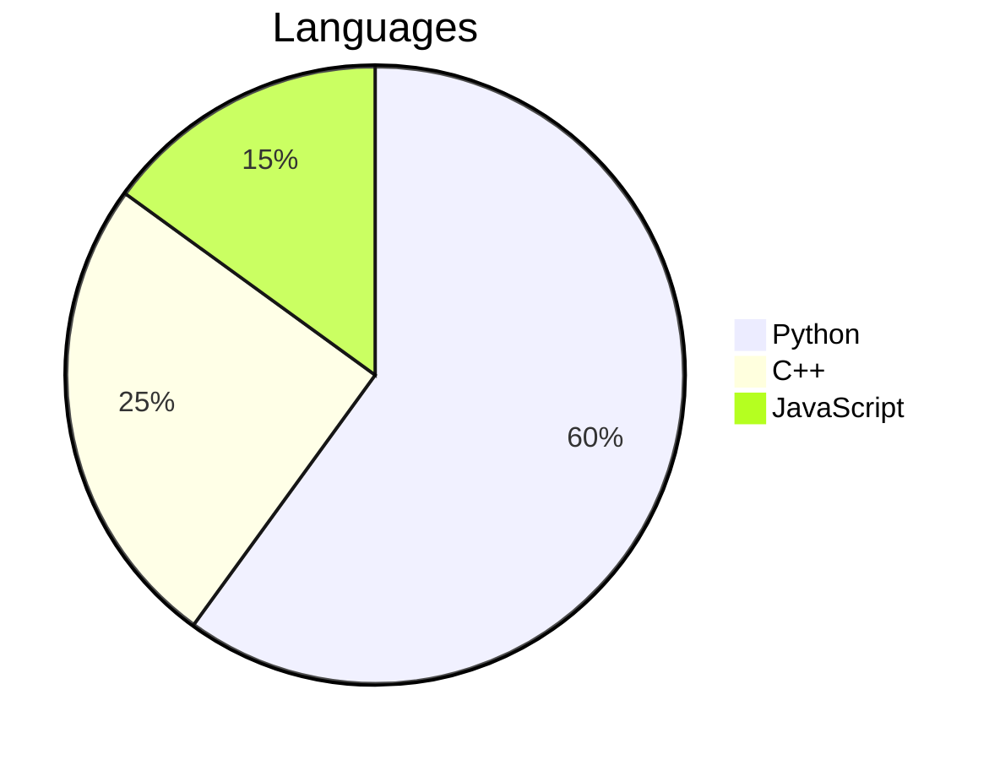
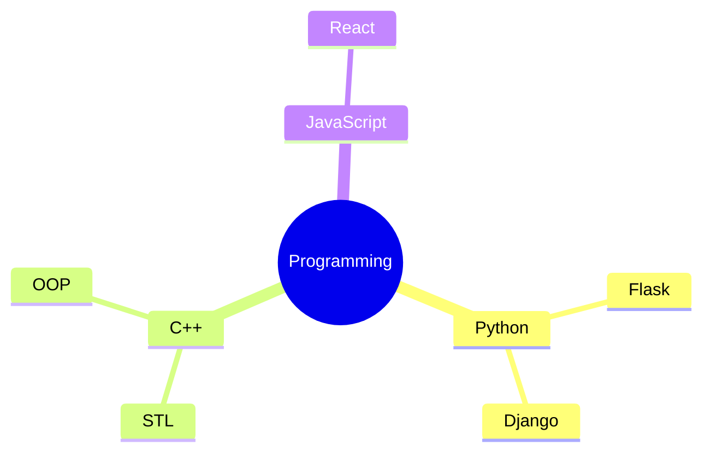

# Hello!
# Markdown Demonstration

This file demonstrates many common Markdown features.

---

# 1. Headings

# Heading 1
## Heading 2
### Heading 3
#### Heading 4
##### Heading 5
###### Heading 6

---

# 2. Paragraphs

This is a normal paragraph.

This is another paragraph separated by a blank line.

---

# 3. Text Formatting

**Bold**

*Italic*

***Bold + Italic***

~~Strikethrough~~

<u>Underline (HTML)</u>

`Inline code`

---

# 4. Blockquotes

> This is a blockquote.
>
> It can span multiple lines.

Nested:

> Outer
>> Inner

---

# 5. Lists

## Unordered

- Apple
- Banana
- Mango

* Orange
* Grapes

+ Kiwi
+ Pineapple

Nested:

- Item 1
  - Child
    - Grandchild

---

## Ordered

1. First
2. Second
3. Third

Nested:

1. Parent
    1. Child
    2. Child

---

## Task Lists

- [x] Install Python
- [x] Install VS Code
- [ ] Learn Flask
- [ ] Build Project

---

# 6. Links

OpenAI:
https://openai.com

Markdown Link:

[OpenAI](https://openai.com)

---

# 7. Images


---

# 8. Horizontal Line

---

***

___

---

# 9. Code

Inline:

`print("Hello")`

Code Block:

```python
def greet(name):
    print(f"Hello {name}")

greet("Akash")
```

Another language:

```javascript
function greet(name){
    console.log("Hello " + name);
}
```

```cpp
#include <iostream>
using namespace std;

int main() {
    cout << "Hello";
}
```

---

# 10. Tables

| Name | Age | City |
|------|----:|------|
| Akash | 22 | Pune |
| Alice | 25 | Mumbai |
| Bob | 30 | Delhi |

Alignment:

| Left | Center | Right |
|:-----|:------:|------:|
| A | B | C |
| 10 | 20 | 30 |

---

# 11. Escaping Characters

\*Not Italic\*

\# Not Heading

\`Not Code\`

---

# 12. HTML Inside Markdown

<div style="color:red">
This is HTML.
</div>

<details>

<summary>Click to Expand</summary>

This text is hidden until expanded.

</details>

---

# 13. Keyboard Keys

<kbd>Ctrl</kbd> + <kbd>C</kbd>

<kbd>Ctrl</kbd> + <kbd>Shift</kbd> + <kbd>V</kbd>

---

# 14. Emoji

😀 😎 🚀 🎉 ❤️

GitHub style:

:smile:
:rocket:
:fire:

---

# 15. Footnotes

Markdown supports footnotes in many renderers.

This sentence has a footnote.[^1]

[^1]: This is the footnote.

---

# 16. Definition List (Some Markdown Flavors)

Term
: Definition

Another Term
: Another Definition

---

# 17. Nested Formatting

- **Bold Item**
    - *Italic Child*
        - `Code Child`

---

# 18. Mathematical Expressions (if supported)

Inline:

$E=mc^2$

Block:

$$
a^2+b^2=c^2
$$

---

# 19. Quotes + Code

> Example command:

```bash
pip install flask
python app.py
```

---

# 20. Checkboxes with Notes

- [x] Python Installed
    - Version 3.12

- [ ] Learn Django
    - Estimated: 2 weeks

---

# 21. Mixed Example

## Project Setup

### Requirements

- Python
- Flask
- Git

### Installation

```bash
python -m venv .venv

source .venv/bin/activate
```

Windows:

```powershell
.venv\Scripts\activate
```

Install packages:

```bash
pip install flask
```

Run:

```bash
python app.py
```

Expected Output:

```text
* Running on http://127.0.0.1:5000
```

---

# 22. Mermaid Diagram (Supported by GitHub, Obsidian, VS Code Extensions)



---

# 23. Mermaid Flowchart



---

# 24. Mermaid Sequence Diagram



---

# 25. Mermaid Class Diagram



---

# 26. Mermaid Gantt



---

# 27. Mermaid Pie Chart



---

# 28. Mermaid Mindmap



---

# 29. Callout (GitHub)

> [!NOTE]
> This is a note.

> [!TIP]
> Helpful information.

> [!IMPORTANT]
> Important information.

> [!WARNING]
> Be careful.

> [!CAUTION]
> Dangerous operation.

---

# 30. End

Congratulations! You've seen many Markdown capabilities.
